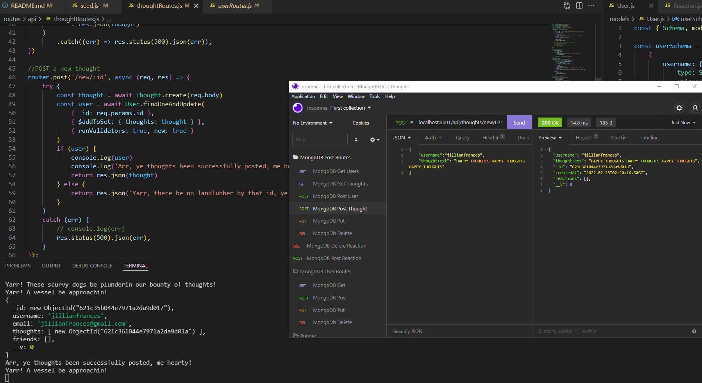

# social-network-api-bcs

## Description

This social-networking API hosts a full suite of clearly labeled CRUD operations that follow RESTful routing conventions, thereby allowing easy integration into a front-end site (which this repository lacks). I wrote this code expressly to help develop my skills in writing routes, hence the lack of a front end, as well as to help me get a handle on using MongoDB for the first time. It has been very illuminating, comparing and contrasting the pros and cons of MongoDB with my prior experience in database design, which was limited to MySQL. The challenges I faced in creating this API have certainly helped me gather a more intuitive sense of how routes should be developed, and this experience will be invaluable in my pursuits outside of class. 

## Table of Contents

- [Installation](#installation)
- [Usage](#usage)
- [License](#license)

## Installation

There is no front-end for this app, which means in order to observe any of its functionality, the user will have to download the code from this repository and operate it themselves. I have recorded a video which briefly walks through this installation and explains how the app functions, linked here: 

[https://youtu.be/ovAWz7fJqfE]

1. Clone the repository using your computer's command line.
2. Open the downloaded folder in VSCode.
3. Install the app's dependencies by running `npm i` in the command line.
4. Seed the app's database by running `npm run seed` in the command line.
5. Instantiate the app's server by running `node index.js` in the command line.

## Usage

Please refer to the linked video above for more in-depth coverage on how to use the app.

1. Be sure you've followed the steps for installation, as detailed above. The app's server must be live in order to use the app.
2. While the server is live, the user has access to a large suite of CRUD operations which operate similar to how a social networking site would operate. The user has the following choices:
  * GET all users
  * GET a single user via id
  * POST a new user
  * PUT to update a user via id
  * DELETE a user (will delete associated user posts) via id
  * POST to add a friend to a user via id
  * DELETE to remove a friend from a user via id
  * GET all thoughts (thoughts are essentially user posts)
  * GET a single thought via id
  * POST a new thought, associated with a specified user
  * PUT to update a thought via id
  * DELETE to remove a thought via id
  * POST to create a reaction (reactions are essentially user replies)
  * DELETE to remove a reaction
3. All routes function as intended. Associations in database structure, e.g. those between a posted thought and the user it belongs to, are cleared when the relevant data is deleted. 
4. It is recommended one uses some type of API client, like Insomnia, to run these routes and observe their outputs.
5. The screenshots below showcase some of the application functionality:

    
    
    

## License

MIT License

Copyright (c) [2022] [shnala]

Permission is hereby granted, free of charge, to any person obtaining a copy
of this software and associated documentation files (the "Software"), to deal
in the Software without restriction, including without limitation the rights
to use, copy, modify, merge, publish, distribute, sublicense, and/or sell
copies of the Software, and to permit persons to whom the Software is
furnished to do so, subject to the following conditions:

The above copyright notice and this permission notice shall be included in all
copies or substantial portions of the Software.

THE SOFTWARE IS PROVIDED "AS IS", WITHOUT WARRANTY OF ANY KIND, EXPRESS OR
IMPLIED, INCLUDING BUT NOT LIMITED TO THE WARRANTIES OF MERCHANTABILITY,
FITNESS FOR A PARTICULAR PURPOSE AND NONINFRINGEMENT. IN NO EVENT SHALL THE
AUTHORS OR COPYRIGHT HOLDERS BE LIABLE FOR ANY CLAIM, DAMAGES OR OTHER
LIABILITY, WHETHER IN AN ACTION OF CONTRACT, TORT OR OTHERWISE, ARISING FROM,
OUT OF OR IN CONNECTION WITH THE SOFTWARE OR THE USE OR OTHER DEALINGS IN THE
SOFTWARE.